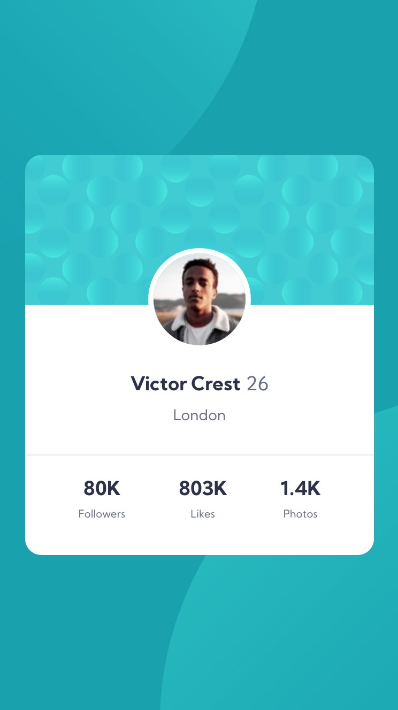

# Frontend Mentor - Profile card component solution

This is a solution to the [Profile card component challenge on Frontend Mentor](https://www.frontendmentor.io/challenges/profile-card-component-cfArpWshJ). Frontend Mentor challenges help you improve your coding skills by building realistic projects. 

## Table of contents

- [Frontend Mentor - Profile card component solution](#frontend-mentor---profile-card-component-solution)
  - [Table of contents](#table-of-contents)
  - [Overview](#overview)
    - [The challenge](#the-challenge)
    - [Screenshot](#screenshot)
    - [Links](#links)
  - [My process](#my-process)
    - [Built with](#built-with)
    - [What I learned](#what-i-learned)
    - [Continued development](#continued-development)
  - [Author](#author)

## Overview

### The challenge

- Create a profile card component to the specified design.

### Screenshot

### Links

- Solution URL: [https://github.com/miguel-tostado/profile_card_component](https://github.com/miguel-tostado/profile_card_component)
- Live Site URL: [https://trusting-swanson-0821a3.netlify.app/](https://trusting-swanson-0821a3.netlify.app/)

## My process

### Built with

- Semantic HTML5 markup
- CSS custom properties
- Flexbox

### What I learned

This project helped me get into flexbox a bit more and relearn css positioning. Getting the different sections was also pretty important so I had to plan ahead to make sure each section was setup to help make using flexbox easier.

I also tried using CSS variables for the font and different colors. Seemed to work alright, but a bit excessive for this small a project. Still, good practice!

### Continued development

I definitely need to get better at positioning - it took a bit longer than I had hoped to get everything setup properly.

Use CSS variables more.

## Author

- Website - [Miguel Tostado](https://www.migueltostado.com/)
- Frontend Mentor - [@miguel-tostado](https://www.frontendmentor.io/profile/miguel-tostado)
- Twitter - [@207Toast](https://twitter.com/207Toast)